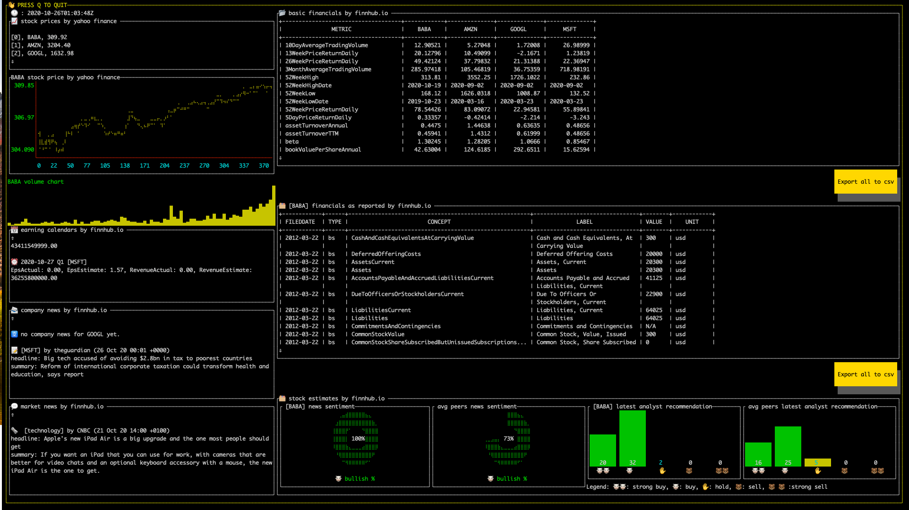

# finnhub-terminal

It is all started from a feature request from [wtfutil/wtf](https://github.com/wtfutil/wtf/issues/930). I simply found it's cool to draw dashboards just with terminals. So I decided to take it further, explore other terminal ui framework and built one for finnhub.io. That's where I found [termdash](https://github.com/mum4k/termdash).



config.json:
```
{
    "apiKey": "your_finnhub_api_key",
    "stocks":[
        "BABA",
        "AMZN",
        "GOOGL",
        "MSFT"
    ]
}
```

```
brew tap applegreengrape/finnhub-terminal https://github.com/applegreengrape/finnhub-terminal
brew install finnhub-terminal

config_path=./config.json fterm
```
N.B. If you are using the free version of finnhub, you might get 429 too many requests error from finnhub.io when it come to a long stock lists (e.g. querying more than 10 stocks in one go).
checkout finnhub's [rate-limit](https://finnhub.io/docs/api#rate-limit) for more information.